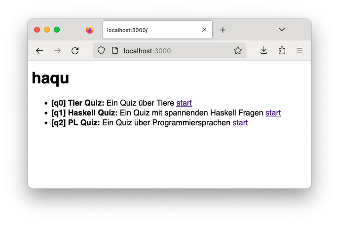
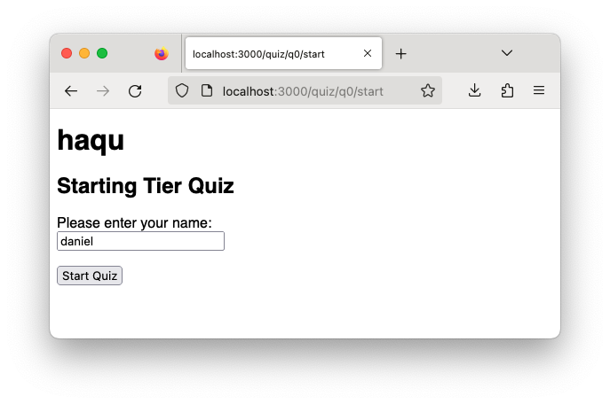
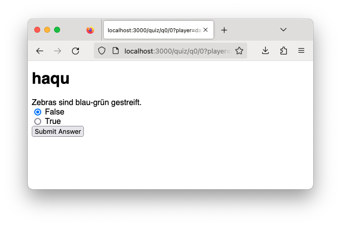
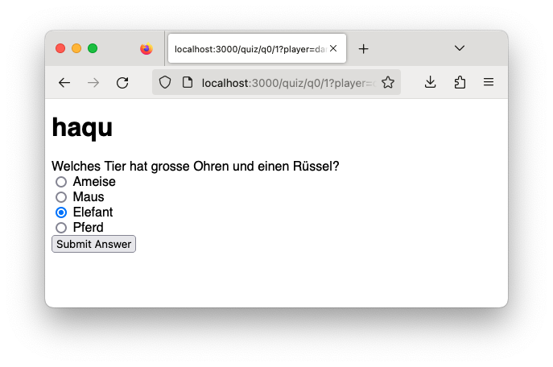
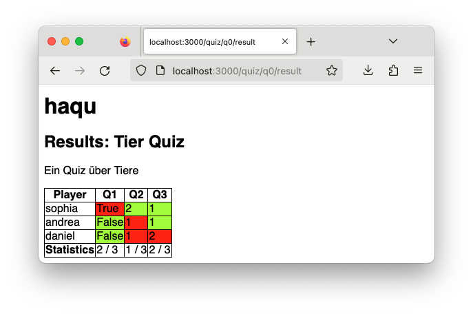

# fprog Programmierprojekt HS23

## Thema
In diesem Programmierprojekt implementieren Sie Ihre eigene Quiz Applikation namens **"haqu"**.


<p>Abbildung 1: Startseite</p>


<p>Abbildung 2: Quiz Starten</p>


<p>Abbildung 3: Wahr/Falsch Frage</p>


<p>Abbildung 4: Einzelauswahl-Frage</p>


<p>Abbildung 5: Resultate</p>

## Rahmenbedingung
- Dieses Projekt ist eine **Einzelarbeit**. Gemäss Prüfungsordnung resultiert ein Verstoss gegen diese Bedingung mit der **Note 1**.
- Das Projekt muss mit GHC 9.2.8 und Cabal 3.6.2.0 (neuere Cabal-Versionen sollten auch in Ordnung sein) gebaut und gestartet werden können.
- Es dürfen keine zusätzlichen Libraries im `haqu.cabal` unter `build-depends` hinzugefügt werden.
- Fragen schicken Sie per Mail an `daniel.kroeni@fhnw.ch`. Ich werde dann die Frage und die Antwort auf MS Teams publizieren, damit alle dieselben Informationen haben.
- Github Copilot, ChatGPT, etc. dürfen verwendet werden. Sie müssen den Code, den Sie abgeben, erklären können.

## Spezifikation der Anwendung
Dieses [Video](https://tube.switch.ch/videos/Be8zXjNFh6) spezifiziert die Funktionalität der Applikation. Es ist somit Teil der Spezifikation. Schauen Sie es sich unbedingt an!

### HTTP Routen
- **Übersichtsseite:** GET http://localhost:3000/
- **Quiz starten Ansicht:** GET http://localhost:3000/quiz/:quiz/start
- **Quiz starten:** POST http://localhost:3000/quiz/:quiz/start  
Im Request Body wird der Spielername `player` als Form Parameter (`formParam`) erwartet.
Nach dem POST wird auf die erste Frage des Quiz umgeleitet (`redirect`).
- **Frage Ansicht:** GET http://localhost:3000/quiz/:quiz/:question?player=example  
Der Spielername `player` wird als Query Parameter (`queryParam`) erwartet.
- **Antwort Speichern:** POST http://localhost:3000/quiz/:quiz/:question?player=example
Der Spielername `player` wird als Query Parameter (`queryParam`) erwartet.  
Im Request Body wird die Antwort `answer` als Form Parameter (`formParam`) erwartet.
Nach dem POST wird auf die nächste Frage des Quiz umgeleitet oder auf das Resultat, wenn es keine weiteren Fragen gibt (`redirect`).
- **Resultat Übersicht:** GET http://localhost:3000/quiz/:quiz/result 


### Datenhaltung
Im Ordner [./data/](./data) werden die Quiz Definitionen, sowie die Antworten pro Quiz und Benutzer gespeichert.

Die Demodaten werden wie folgt abgegeben:

```
data
├── q0                -- Anworten für Quiz q0
│   ├── andrea.txt    -- Anworten für Quiz q0 von Spielerin andrea
│   └── sophia.txt   -- Anworten für Quiz q0 von Spielerin sophia
├── q1
│   ├── hans.txt
│   ├── fredrik.txt
│   └── martina.txt
├── q2
│   └── susanne.txt
├── q0.txt            -- Quiz q0
├── q1.txt
└── q2.txt
```

In den Beispieldaten sind drei Quizzes vorhanden: `q0.txt`, `q1.txt` und `q2.txt`. Jedes Quiz ist beschrieben in einer Text Datei. Eine Bezeichnung wie z.B. `q0` nennen wir die `ID` eines Quizzes.
Für jedes Quiz gibt es einen Ordner mit dem Namen der `ID` des Quiz. In diesem Ordner werden die Antworten der Spielenden gespeichert.

#### Quiz Datei Format
Hier ist der Inhalt der Datei `q1.txt`:

```
NAME:Haskell Quiz
DESC:Ein Quiz mit spannenden Haskell Fragen

TYPE:SINGLECHOICE
Q:Was ist der Typ von isDigit?
A:Char
A:Bool -> Char
A:Char -> Bool
A:Bool
S:2

TYPE:FALSETRUE
Q:Haskell Listen können unendlich lang sein!
S:True
TYPE:FALSETRUE
Q:Macht das Spass?
S:True
```

Eine Quiz Datei ist zeilenweise aufgebaut. Jede Zeile besteht aus einem Schlüssel-Werte-Paar. Der Schlüssel ist dabei mit `:` vom Wert separiert.
Es gibt auch Leerzeilen - die werden jedoch einfach ignoriert. Sie können also nicht davon ausgehen, dass z.B. die Fragen mit Leerzeilen getrennt sind.

Die folgenden Schlüssel sind definiert:
- `NAME`: Der Name des Quiz
- `DESC`: Eine Beschreibung des Quiz
- `TYPE`: Der Typ der Frage. Es gibt zwei Typen:
  - `SINGLECHOICE`: Eine Frage mit beliebig vielen möglichen Antworten. Es ist jeweils nur eine Antwort richtig.
  - `FALSETRUE`: Eine Frage mit zwei Antwortmöglichkeiten. Es ist jeweils nur eine Antwort richtig.
- `Q`: Der Fragetext.
- `A`: Eine Antwortmöglichkeit. Nur bei `SINGLECHOICE`. Es können mehrere `A` Einträg vorhanden sein.
- `S`: Die Nummer (0-basiert) der richtigen Antwortmöglichkeit oder `False`/`True`. Es kann nur ein `S` Eintrag pro Frage vorhanden sein.

Sie können davon ausgehen, dass die Quiz Dateien immer korrekt aufgebaut sind. Sie müssen also keine Fehlerbehandlung implementieren.

#### Antwort Datei Format
Pro Quiz werden in einem Ordner die Antworten der Spielenden gespeichert. Der Dateiname ist gleich dem Namen des Spielenden mit einem ".txt"-Suffix. Hier ist der Inhalt der Datei `q1/hans.txt`:
```
0:2
1:False
2:True
```
Jede Zeile entspricht der Antwort auf eine Frage. Format `<FrageNr>:<AntwortOption>`.

## Aufgabe
Implementieren Sie die beschriebene Applikation.

## **Bewertung**
Zur Bewertung der Arbeit werden funktionale sowie nicht-funktionale Kriterien herangezogen.

Grundsatz: Die folgenden Kriterien richten sich an angehende Software-Ingenieur*innen. Ich gehe davon aus, dass wir in den Grundsätzen ein gemeinsames Verständnis davon haben, was sinnvoll ist und was nicht. Es geht nicht darum ein Schlupfloch in der Formulierung zu finden, sondern darum eine "vernünftige" Lösung zu bauen.

⚠️ Wichtig! Die Kriterien sind **Alles oder Nichts**. Halb erfüllte Kriterien geben 0 Punkte.

### **Funktionale Anforderungen (16 Punkte)**

Sie haben Demodaten für drei Quizzes im `data/` Ordner. Jedes Quiz ist im oben spezifizierten Format beschrieben.  
Die Quizzes müssen nicht bereits zu Beginn aus den Textdateien geladen werden. Sie können gut beginnen, indem Sie z.B. eine Liste `quizzes :: [Quiz]` in Ihrem Programm definieren, worin die drei Quizzes als Werte / Datenstruktur modelliert sind. Damit können Sie bereits die meisten funktionalen Anforderungen erüllen - einzige Ausnahme ist **(F13)**.

Es gibt aber keine Punkte für _fake_ Lösungen. HTML, das statisch, und nicht basierend auf den Dateien, oder einer Datenstruktur dynamisch gebaut wird, gibt jeweils keine Punkte.

Bei einigen Kriterien müssen die Quizzes modifiziert werden, um zu überprüfen, ob die Informationen wirklich aus den Dateien oder der Datenstruktur geladen wird.
Vergessen Sie nicht, nach einer Änderung die Applikation neu zu bauen und zu starten mittels `cabal run haqu`.

Um die Bewertung einfacher zu machen, vermerken Sie [zuunterst](#file-or-memory) in dieser Datei, ob Ihre Lösung direkt aus den Dateien lesen, oder wo die Liste der Quizzes zu finden ist.


#### **(F1) Home (1Pt)**
Auf der Home Seite wird mindestens folgendes angezeigt:
- Ein Titel z.B. "haqu".
- Eine Liste mit den drei Quizzes, der Initialdaten.
- Für jedes Quiz wird dessen `ID`, `Name` und `Beschreibung` dargestellt.
- Die Quizdaten müssen entweder aus den Quiz-Dateien oder aber aus einer Datenstruktur geladen werden.

**Test URL:** http://localhost:3000/  
**Test:** 
- Modifizieren Sie die ID, den Namen und die Beschreibung eines Quizzes und überprüfen Sie, ob die Änderung sichtbar ist.
- Fügen Sie eine zusätzliches Quiz hinzu und überprüfen Sie, ob das neue Quiz sichtbar ist.
- Entfernen Sie alle Quizzes. Die Seite muss auch ohne Quizzes funktionieren.  

#### **(F2) Home Startlink (1Pt)**
Hinter jedem Quiz Eintrag hat es einen Link namens `"start"`. Beim Klick auf diesen Link wird auf die Quiz Startseite, das Namensformular, umgeleitet. Die Quiz Startseite ist unter folgender URL erreichbar: `http://localhost:3000/quiz/<quiz-id>/cabal run prereq`. Die `<quiz-id>` ist dabei die `ID` des Quizzes, das gestartet wurde.

**Test URL:** http://localhost:3000/  
**Test:** Klicken Sie den `"start"` Link beim Quiz mit der `ID` `q0`. Folgende Seite sollte geöffnet werden: http://localhost:3000/quiz/q0/start.

#### **(F3) Namensformular - Ansicht (1Pt)**
Auf dem Namensformular wird mindestens folgendes angezeigt:
- Ein Titel z.B. "haqu".
- Ein Untertitel, der den Namen des zu startenden Quiz enthält. Z.B. "Starting Haskell Quiz".
- Ein Textfeld, um den Namen des Spielenden einzugeben.
- Ein Button "Start Quiz" um das Spiel zu starten.

**Test URL:** http://localhost:3000/quiz/q0/start


#### **(F4) Namensformular - Submit (1Pt)**
Bei Drücken des Start-Buttons wird ein POST Request an die URL `http://localhost:3000/quiz/<quiz-id>/start` gesendet. Der Name des Spielenden wird dabei als Form Parameter `player` mitgesendet. Nach dem POST wird auf die erste Frage des Quiz umgeleitet.

**Test:** Im Textfeld einen Namen eingeben und den Start Button drücken. Im Terminal kann nun der Log überprüft werden. Es muss ein POST Request an die entsprechenden URL und Request Body mit einem `player` Parameter angezeigt werden.
```
POST /quiz/q0/start
  Params: [("player","daniel")]
  Request Body: player=daniel
  ...
```


#### **(F5) FalseTrue Frage - Ansicht (1Pt)**
FalseTrue Fragen werden wie folgt dargestellt:
- Ein Titel z.B. "haqu".
- Der Fragetext.
- Zwei Radio Buttons mit den Texten "False" und "True".
- Ein "Submit Answer" Button um die Antwort zu speichern.

Die Frage muss aus der entsprechenden Datei oder einer Datenstruktur geladen werden.

**Test URL:** http://localhost:3000/quiz/q0/1?player=daniel  
**Test:** Modifizieren Sie die Frage `q0/1` in der entsprechenden Datei oder Datenstruktur und überprüfen Sie, ob die Änderung dargestellt wird.


#### **(F6) Single Choice Frage - Ansicht (1Pt)**
Single Choice Fragen werden wie folgt dargestellt:
- Ein Titel z.B. "haqu".
- Der Fragetext.
- Alle Antwortoptionen als Radio Buttons mit den Texten der Antwortoptionen.
- Ein "Submit Answer" Button um die Antwort zu speichern.

Die Frage muss aus der entsprechenden Datei oder einer Datenstruktur geladen werden.

**Test URL:** http://localhost:3000/quiz/q0/0?player=daniel  
**Test:** Modifizieren Sie die Frage `q0/0` in der entsprechenden Datei oder Datenstruktur und überprüfen Sie, ob die Änderung dargestellt wird.


#### **(F7) Frage - Submit (1Pt)**
Beim Submit einer Frage wird ein POST Request an die URL `http://localhost:3000/quiz/<quiz-id>/<question>?player=<player>` gesendet. Der Name des Spielenden wird dabei als Query Parameter `player` mitgesendet. Die Antwort wird als Form Parameter `answer` mitgesendet.

**Test URL:** http://localhost:3000/quiz/q0/1?player=daniel  
**Test:** Antwort auswählen und Submit drücken. Im Terminal den Log überprüfen. Es soll ein POST Request mit der entsprechenden URL und dem Form Parameter `answer` geben. 
```
POST /quiz/q0/0
  Params: [("answer","False")]
  Request Body: answer=False
  ...
```
Hinweis: Der Query Parameter `player` ist im Log leider nicht sichtbar.


#### **(F8) Frage - Submit - Redirect (1Pt)**
Nach dem Submit wird auf die nächste Frage des Quiz umgeleitet 
oder auf die Resultatseite, wenn es keine weiteren Fragen gibt.

**Test:** Spielen Sie ein Quiz durch und kontrollieren Sie, ob Sie auf die nächste Frage oder am Ende auf das Resultat umgeleitet werden. 


#### **(F9) Frage - Submit - Persistenz (2Pt)**
Bei einem Submit wird die Antwort in der entsprechenden Datei gespeichert. Die Datei ist dabei im Ordner des entsprechenden Quizzes und hat den Namen des Spielers und eine ".txt" Endung (z.B. `data/q0/hans.txt`). Die Antwort wird dabei als Zeile mit dem Format `<FrageNr>:<Antwort>` angefügt. Die Fragenummer beginnt bei 0.

Wenn ein weiteres Quiz mit dem selben Spielernamen (und somit einem bereits existierenden Antwort-File) gespielt wird, sollen die Antworten der vorherigen Runde verworfen werden.

**Test:** 
- Spielen Sie eine Runde und kontrollieren Sie, ob die Datei neu angelegt und ob die Antwort korrekt gespeichert wurde.
- Spielen Sie eine zweite Runde mit dem selben Namen und stellen Sie sicher, dass die alten Antworten überschrieben werden.


#### **(F10) Resultat - Tabelle (2Pt)**
Auf der Resultat Seite wird mindestens folgendes angezeigt:
- Ein Titel z.B. "haqu".
- Ein Untertitel, der den Namen des gespielten Quiz enthält. Z.B. "Resultat Haskell Quiz".
- Eine Tabelle 
  - Header Zeile: Spalte für den Spielername und für jede Frage eine Spalte "Q1", "Q2", etc. (das kann auch 0 basiert sein "Q0", ...)
  - Für alle Resultatdateien des Quizzes, eine Zeile mit dem Namen des Spielenden und für jede Frage dessen Antwort.
Die Resultatseite muss auch funktionieren, wenn noch keine Antworten verfügbar sind.
Die Daten müssen aus dem Dateisystem geladen werden!

**Test URL:** `http://localhost:3000/quiz/q0/result`  
**Test:** 
- Fügen Sie eine Antwort-Datei hinzu und kontrollieren Sie, ob diese beim Refresh entsprechend angezeigt wird.
- Löschen Sie alle Antowort-Dateien, es muss eine leere Tabelle oder Hinweis, dass noch keine Resultate vorhanden sind, dargestellt werden.

#### **(F11) Resultat - Tabelle - Farbe (1Pt)**
Jede Antwort von jedem Spielenden ist grün markiert, wenn sie richtig ist und rot, wenn sie falsch ist.

#### **(F12) Resultat - Tabelle - Statistik (1Pt)**
Für jede Frage wird die Anzahl richtiger Antworten angezeigt.
Format: <#korrekt> / <#total>

Die Statistik muss auch funktionieren, wenn noch keine Antworten verfügbar sind.

#### **(F13) Quizzes werden aus Dateien geladen (2Pt)**
Die verfügbaren Quizzes sowie deren Fragen werden aus Textdateien eingelesen. Es wird das oben beschriebene Format verwendet.

**Test:** 
1. Fügen Sie eine Quiz Datei dem `data/` Ordner hinzu und kontrollieren Sie, ob diese beim Refresh entsprechend auf der Startseite erscheint.
2. Modifizieren Sie den Inhalt einer Quiz Datei, spielen Sie das Quiz durch und kontrollieren Sie, ob die Änderungen korrekt angezeigt werden.


### **Nicht Funktionale Anforderung (4 Punkte)**
#### **(NF1) Codesize (1Pt):**
Der Code muss auf mindestens 3 Module aufgeteilt sein. `app/Main.hs` und `test/HaquTest.hs` werden dabei nicht mitgezählt. 
Zudem gilt:
- Maximale Anzahl zulässige Zeilen pro Funktion: 20 Zeilen. 
- Maximale Anzahl zulässige Zeichen pro Zeile: 100 Zeichen.
Kommentare und Leerzeilen werden nicht mitgezählt.

⚠️ Wenn auch nur eine Funktion länger ist (Signatur mitgezählt), gibt es 0 Punkte. Das gilt auch für `main :: IO ()`.

**Test:** 
1. Module zählen
2. Die Inhalte überfliegen und bei grossen Funktionen die Zeilen zählen (bzw. im Editor selektieren und kontrollieren).

#### **(NF2) 0 Warnungen (1Pt):**
Beim Build dürfen keine Warnungen auftreten.

**Test:** 
1. Führen Sie `cabal clean` aus, damit im nächsten Schritt alles neu gebaut wird. 
2. Führen Sie `cabal build` aus. Es darf keine Warnung ausgegeben werden.

Wenn auch nur eine Warnung ausgeben wird, gibt es 0 Punkte.

Es geht um Warnungen, die der Compiler in Ihrem Code findet.  
Folgende Warnung wird nicht gezählt: "ld: warning: -single_module is obsolete"

#### **(NF3) Storage Module (1Pt):**
Die Persistenz wird in einem einzigen Modul implementiert.

**Test:**  
Nur ein einziges Modul verwendet Funktionalität um mit dem Dateisystem zu interagieren. Nur dieses Modul darf `System.Directory` importieren und `readFile`,  `writeFile`, `appendFile` und `deleteFile` aus dem `Prelude` verwenden.

Die Scotty Funktion `file` ist eine Ausnahme und muss nicht zwingend in das storage Modul, darf aber.

#### **(NF4) Kommentare (1Pt):**
Jedes Modul, jeder Typ und jede top-level Definition (Funktion und Konstante) hat einen Kommentar, der die Funktionalität beschreibt.


# Abgabe der Arbeit
Abgabetermin: **Sonntag, 17.12.2023 23:59.**

Zur Abgabe müssen Sie eine anonyme Version Ihrer Lösung in der Peergrading Webapplikation hochladen. Sie können so häufig hochladen wie Sie möchten. Die letzte Abgabe vor der Deadline wird dann bewertet.

Gehen Sie dazu wie folgt vor:

1. Erstellen Sie eine Kopie des Ordners, der Ihre Lösung enthält.
2. Nennen Sie diesen Ordner en2_haqu
3. Löschen Sie darin alle Dateien, die Ihre Identität preisgeben könnten. Beispiele:
 - `.git` Ordner
 - `dist-newstyle` Build Ordner
4. Dann komprimieren Sie diesen Ordern:
 - WIN: Rechtsklick "Send To" > compressed (zipped) folder
 - OSX: Rechtsklick "compress "en2_haqu"
5. Dieses Archiv laden Sie dann hoch.


## Hinweise
### **Arbeiten mit Scotty**
Mit `redirect :: LT.Text -> ActionM a` kann auf eine andere Seite umgeleitet werden. 
https://hackage.haskell.org/package/scotty-0.20.1/docs/Web-Scotty.html#v:redirect
Beispiel: Umleitung auf Home Page:
```haskell
redirect "/"
```

Um `String` nach `LT.Text` zu übersetzen, verwenden Sie:
```haskell
import qualified Data.Text.Lazy as LT
ghci> :t LT.pack
LT.pack :: String -> LT.Text
```
----
### **Sortieren von Listen**
Im Modul `Data.List` sind viele praktische Funktionen zu finden um mit Listen zu arbeiten:
```haskell
import Data.List (sort)
```
`sort :: Ord a => [a] -> [a]` sortiert eine Liste.

----
### **Arbeiten mit Pfaden**
Das Typalias `FilePath` ist ein Alias für den Typ `String`. Pfade auf Dateien und Ordner können Sie also leicht aus `String`s zusammenbauen. Als Pfadseparator verwenden Sie bitte alle `"/"`, auch auf Windows. Alle Pfade sollten relative zum Wurzelverzeichnis des Projekts sein. Wenn Sie absolute Pfade verwenden, wird das bei anderen Studierenden dann nicht funktionieren.

----
### **Arbeiten mit `IO a` und `ActionM a`**
Folgende Funktion könnten sich als nützlich erweisen:
```haskell
import Control.Monad (mapM)

mapM :: (a -> m b) -> [a] -> m [b]
mapM_ :: (a -> m b) -> [a] -> m () -- wie mapM, ignoriert das Resultat, aber hat die Effekte
sequence :: [m a] -> m [a]
sequence_ :: [m a] -> m () -- wie sequence, ignoriert das Resultat, aber hat die Effekte
```

Das `m` kann dabei für `IO` oder auch `ActionM` stehen. So können Sie z.B. zwei Strings von der Konsole einlesen:

```haskell
readTwoStrings :: IO [String]
readTwoStrings = mapM (\s -> putStrLn s >> getLine) ["a:","b:"]
```

----
#### **Arbeiten mit dem Dateisystem**
Wir verwenden Funktionen aus dem Package [directory](https://hackage.haskell.org/package/directory-1.3.6.1/docs/System-Directory.html) um Verzeichnisse zu erzeugen und deren Inhalte aufzulisten.
Die Funktionen sind im Modul `System.Directory` und müssen entsprechend importiert werden.

```haskell
import System.Directory (listDirectory, doesDirectoryExist, createDirectory, doesFileExist, removeFile)
```

Mit der Funktion `appendFile :: FilePath -> String -> IO ()` können Sie Text an eine Datei anhängen. Die Datei wird dabei erzeugt, falls sie noch nicht existiert.

⚠️ Verwenden Sie `listDirectory` und nicht `getDirectoryContents`, da es sonst Probleme mit `.` und `..` im Resultat kommen kann. Beachten Sie, dass noch versteckte Dateien (z.B. `.DS_Store`) im Verzeichnis liegen können. Filtern Sie also die Listen der Dateien und wählen Sie nur diejenigen aus, die Sie brauchen.

----
#### **Arbeiten mit Modulen**
Zusätzliche Module müssen im `haqu.cabal` File unter `library` `->` `exposed-modules:` hinzugefügt werden. Sonst scheitert `gcc` in der Linker Phase:

```
ld: symbol(s) not found for architecture x86_64
clang: error: linker command failed with exit code 1 (use -v to see invocation)
`gcc' failed in phase `Linker'. (Exit code: 1)
```
Achten Sie auf korrekte Gross-Kleinschreibung der Modulnamen. Windows ist da weniger strikt als OSX - aber Ihr Projekt muss auf allen Plattformen funktionieren.

----
#### **Html für Anfänger**
> Halten Sie das Html einfach, das ist keine Web-Vorlesung.

Eine statische [HTML Demo-Seite](./static/form_example.html) zur orientierung und ein vorbereitetes [CSS](./static/styles.css) zur direkten Verwendung steht zur Verfügung.

Folgende Seite konsultiere ich regelmässig, wenn ich Html schreiben muss: https://www.w3schools.com/

- [Basics](https://www.w3schools.com/html/html_basic.asp)
- [Links](https://www.w3schools.com/html/html_links.asp)
- [Formular](https://www.w3schools.com/html/html_forms.asp)

**CSS:**
Sie brauchen keine eigenen Styles hinzuzufügen. Wenn Sie das aber trotzdem machen, müssen Sie evtl. im Browser mit einem Hard-Reload `CTRL-Shift-R` / `CMD-Shift-R` die Seite neu laden.


# File or Memory
Bitte kreuzen Sie das entsprechend an um die Korrektur zu vereinfachen:

[x] Die Quizzes werden direkt aus den Dateien geladen.  
[] Die Quizzes sind in einer Liste namens ___________ im Modul ________ zu finden.


Ich wünsche Ihnen viel Erfolg 👍